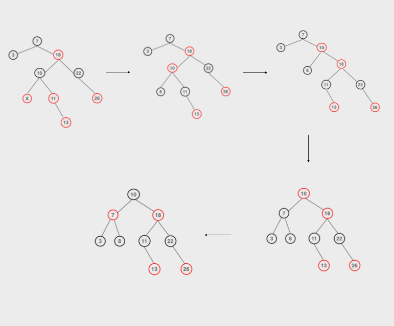
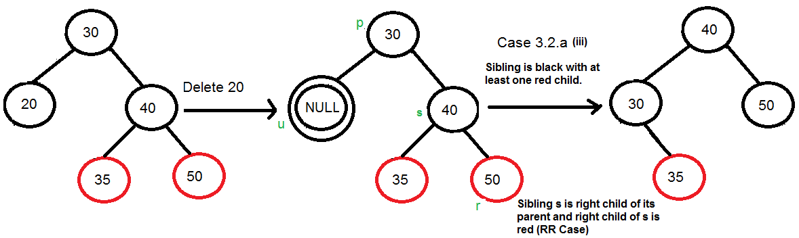
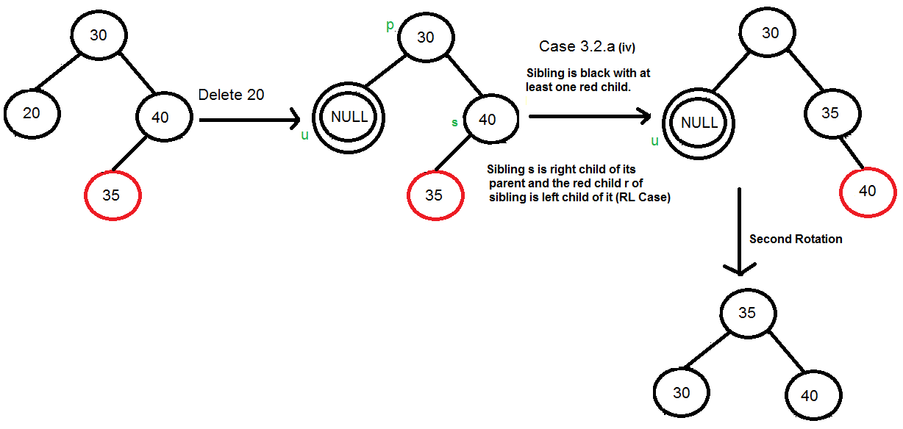
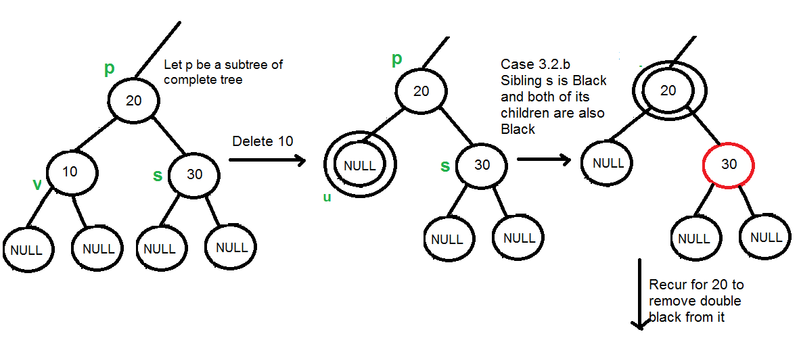
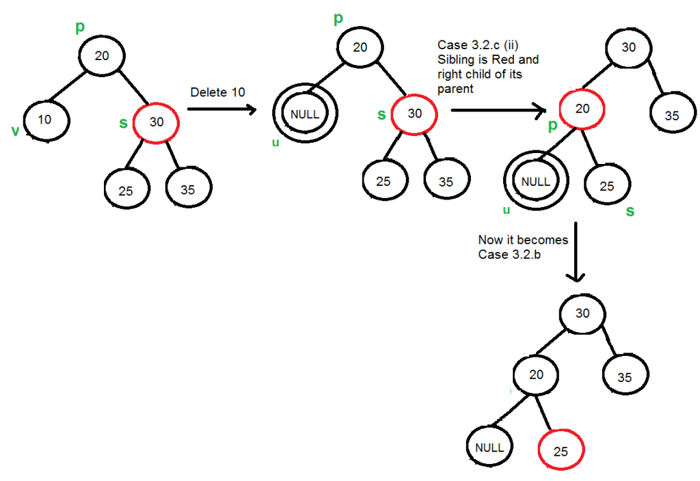

[geekforgeek](https://www.geeksforgeeks.org/red-black-tree-set-1-introduction-2/)

## 红黑树首先是一棵二叉查找树

1. 若任意结点的左子树不空，则左子树上所有结点的值均小于它的根结点的值；
2. 若任意结点的右子树不空，则右子树上所有结点的值均大于它的根结点的值；
3. 任意结点的左、右子树也分别为二叉查找树。
4. 没有键值相等的结点（no duplicate nodes）。

## 红黑树需要满足：
1. 每个结点要么是红的，要么是黑的。  
2. 根结点是黑的。  
3. 每个叶结点（叶结点即指树尾端NIL指针或NULL结点）是黑的。  
4. 如果一个结点是红的，那么它的两个儿子都是黑的。
5. 对于任一结点而言，其到叶结点树尾端NIL指针的每一条路径都包含相同数目的黑结点。  

## 左旋与右旋

## 如何插入X：
与AVL不同的是，不只是有旋转，而是

1. 着色
2. 旋转

**注意：红黑树的任何操作都会保证原来部分的左右黑色节点数量的差值与操作之后一样，使得整棵树总体始终在任何路径上的黑色节点数量都是一样的。**
### **算法如下：**

I. 插入的过程根据普通的二叉查找树，递归地找到查找点。即，

1. 如果新值比当前节点小，往节点的左子树找，否则往有节点找
2. 插入后，将节点着成红色；如果节点是根节点，将节点着成黑色

II. 如果父节点是黑色的，不需要做fix处理；如果父节点是红色的，那fix的情况要根据叔叔节点的情况来进行处理：

III. 当X的父节点是红色的，或者X不是根节点：

**a. 如果叔叔是红色的**

1. 将当前节点的父亲和叔叔涂成黑色
2. 父亲和叔叔是一定有自己的父节点的，将当前节点的爷爷节点涂成红色
3. 将X指向爷爷节点，继续执行循环

**b. 如果叔叔是黑色的**

#### 1） X是爷爷节点的左孩子的左孩子

1. 以当前X的爷爷节点为中心进行右旋（这样父亲来到了爷爷节点的位置，X与爷爷变成了兄弟）
2. 将爷爷（现在在了X的兄弟节点位置）涂成红色，爸爸涂成黑色

#### 2） X是爷爷节点的左孩子的右孩子

1. 先以X的父节点为中心进行左旋，然后让X指向X的父节点
2. 对当前树进行 1） 中的操作

#### 3） X是爷爷节点的右孩子的右孩子

是 1） 的镜像操作

#### 4） X是爷爷节点的右孩子的左孩子

是 2） 的镜像操作

**一个小练习**

## 删除

同样使用着色与旋转，检查兄弟的颜色而不是叔叔的颜色。

在插入中，会造成问题的是两个连续的红色节点；但是在删除中，如果删除的是黑色节点，可能会造成这条路径上到叶子节点的黑节点总数减少。

**算法如下**

I. 先进行[普通的二叉查找树删除过程：](https://www.geeksforgeeks.org/binary-search-tree-set-2-delete/)
如果将被删除的节点D有左右孩子，那么就将中序遍历时，被删节点的前驱或后继节点（V）的值拷贝给D，并删除V，这样便能够保证新的树依旧是一颗二叉查找树。V一定是叶子节点或者只有一个孩子（[一个孩子不代表它只是一个节点](https://cdncontribute.geeksforgeeks.org/wp-content/uploads/BSTDelete-1.png)）。

II. 之后在删除V的过程中，要考虑颜色问题。

设V为被删除的节点，U为替代V的节点。

注意：当V是叶子的时候，U是黑色的NIL（NULL）。V只有最多一个孩子。U V不可能同时是红色

**a. 当U或V中有一个节点是红色的且V不是root**

将U变为黑色即可，这样可以保证红黑树的必要条件5

**b. 当U、V都是黑色且V不是root**

U代替原来的黑色节点V后，这条路径上的黑色节点的总数就-1， 需要可能通过旋转调整。怎么调整要看替换后此时U兄弟节点的颜色：

####  1）兄弟是黑色，有孩子是红色

1. 兄弟是右孩子，兄弟的右孩子r是红色的，或有两个红色孩子l，r

以U（此时已经在V的位置上）的父亲节点为支点左旋，并将r涂黑

2. 兄弟是右孩子，兄弟的左孩子是红色的

* 先以兄弟节点为支点右旋，再以U的父亲为支点左旋，将红色节点l涂黑

3、4. 兄弟是左孩子的情况如1、2的镜像操作

####  2）兄弟是黑色，孩子都是黑色

将兄弟涂成红色

**但此时操作还没有结束，这颗子树的黑色节点的总数依旧比原来的减少了1，所以要递归地以U的父节点为当前U循环着色**
####  3）兄弟是红色的

当兄弟是红色的，他的孩子和父亲必然是黑色的

对于第一棵树，左右的黑色节点数量为3

对于倒数第二棵树，右子树的黑色节点数量为3，而30->20->null的黑色节点数量为2，所以要将20涂黑，将25涂红

**c. V是root**

将U涂黑

## 其他问题
1. 一棵只有黑节点的树也**可以**是红黑树
2. Every Red Black Tree with n nodes has height <= 2Log2(n+1)
3. a node of height h has black-height >= h/2.

